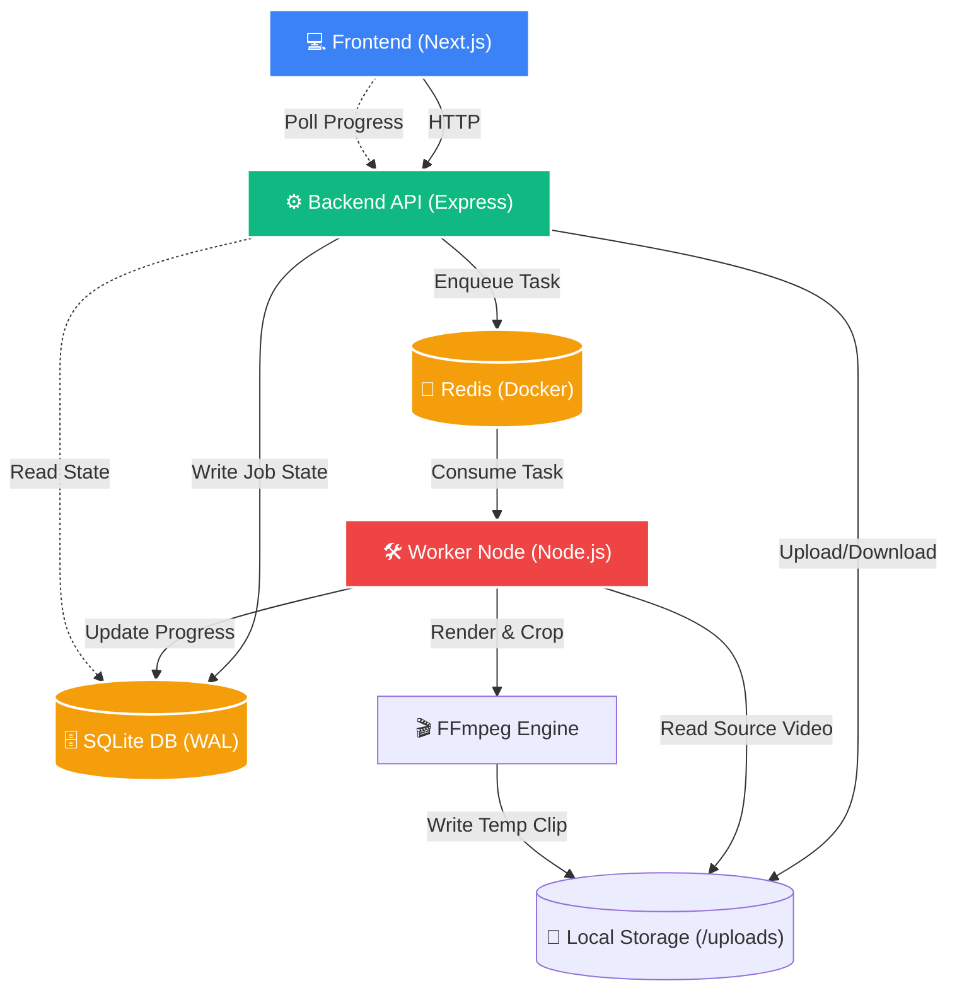

# ClipPods Video Chopper ✂️

A production-grade SaaS application for video clipping — upload or import from YouTube, trim precisely, apply complex aspect ratio formatting, and render high-quality social media clips locally.

---

## 🏗️ System Architecture

ClipPods uses a distributed, concurrent processing pipeline split across three tier layers, leveraging background job queues for safety and efficiency.



---

## ⚡ Core Workflows

### 1. Video Ingestion Pipeline
Videos enter the system via direct upload (chunked safely by `multer` using UUIDs) or via YouTube import. 
*   **YouTube Import:** The API spawns a background `yt-dlp` child process. To protect server health, it first runs a pre-flight `--dump-json` to reject live streams or videos exceeding 2 hours.
*   **Smart Suggestions:** During YouTube ingestion, audience retention heatmaps are extracted to automatically suggest "Highest Replay Value" clips natively in the UI.

### 2. Editor & Range Streaming
The frontend Next.js App Router presents a sleek, monochrome, Apple-inspired timeline editor. It streams the raw video from the backend using standard HTTP `206 Partial Content` headers, preventing the need to download massive files entirely into browser memory.

### 3. Rendering & Output
Once the user requests a clip, the task is locked into **BullMQ**. The standalone worker process guarantees deduplication and initiates **FFmpeg**. It supports:
*   Stream copying (`-c copy`) for instant fast-cuts.
*   Deep re-encoding (`libx264/aac`) for precision timing and aspect ratio swaps (e.g., 16:9 ➔ 9:16 vertical TikTok formatting).
*   **Atomic file writes:** Clips render to a temporary `_rendering.mp4` state and rename instantly upon completion, guaranteeing the user never downloads a half-written file.

---

## 🛠️ The Tech Stack (And Why We Chose It)

| Layer | Technology | Why it was chosen |
|-------|------------|-------------------|
| **Frontend** | React 18, Next.js, TailwindCSS | Unmatched component architecture for building complex state-driven video editors. App router handles server-side rendering for optimal Core Web Vitals. |
| **Backend** | Node.js, Express, TypeScript | Node's non-blocking I/O model is the gold standard for orchestrating massive file streams, handling multipart uploads, and spawning thousands of child processes without freezing. |
| **Database** | SQLite3 (WAL Mode) | Since the architecture writes huge video files to the local disk, keeping metadata tightly coupled in a local serverless file eliminates DB network latency. WAL mode prevents locking during concurrent worker saves. |
| **Message Queue**| BullMQ & Redis (Docker) | Node's premier job queue. Runs in-memory, handling concurrency limits, automatic retries, and job deduplication flawlessly. |
| **Processing** | FFmpeg & yt-dlp | The undisputed, industry-standard binaries for video manipulation and extraction capable of safely rendering huge payloads. |

---

## 🐳 Why Docker?

While the Node apps run natively, **Redis is executed exclusively inside a Docker Container** (`docker-compose up -d`). 
*   **The Problem:** BullMQ requires modern Redis (v5.0+) for advanced commands. Native Windows ports of Redis are functionally obsolete (frozen at v3.x).
*   **The Solution:** Docker guarantees that whether developing locally on Windows or deploying to an Ubuntu cloud server, the datastore executes in exactly the same stable environment. The container is mapped to port `6380` to safely bypass any old background services on the host machine.

---

## 🛡️ Production Readiness Features

ClipPods has been heavily audited and upgraded to handle abusive payloads and ensure strict reliability:

*   **Command Injection Safety:** All `yt-dlp` arguments are passed as discrete array blocks to Node's `spawn()`, eliminating string-interpolation shell vulnerabilities.
*   **Cross-Device Resiliency:** File storage mechanisms handle Windows `EXDEV` native move failures seamlessly via copy+unlink fallbacks.
*   **Deadman Switches:** FFmpeg worker threads feature hard 30-minute execution timeouts to prevent stuck encodings from holding the queue hostage forever.
*   **Garbage Collection:** A background `{cron}` scheduler awakens every 30 minutes to permanently delete orphaned `temp/` records and broken `_rendering` artifacts older than an hour.

---

## 💻 Local Development Setup

### 1. Prerequisites
| Dependency | How to Get It |
|------------|----------|
| **Node.js** | v18+. Download from https://nodejs.org |
| **Docker** | Validated Docker Desktop daemon running (required for Redis). |
| **FFmpeg** / **yt-dlp** | Must be in your system `PATH` or placed in `D:\tools\ffmpeg\bin`. Run `.\scripts\setup-windows.ps1` to test locations. |

> [!IMPORTANT]  
> Start Docker Desktop **before** running the backend to ensure Redis boots correctly.

### 2. Boot Sequence
Open four separate terminal windows in the project root:

**Terminal 1 (Redis Engine):**
```bash
docker-compose up -d
```

**Terminal 2 (API Backend - Port 4000):**
```bash
cd backend
npm install
npm run dev
```

**Terminal 3 (Render Worker):**
```bash
cd worker
npm install
npm run dev
```

**Terminal 4 (Next.js UI - Port 3000):**
```bash
cd frontend
npm install
npm run dev
```

Open **http://localhost:3000** in your browser.
